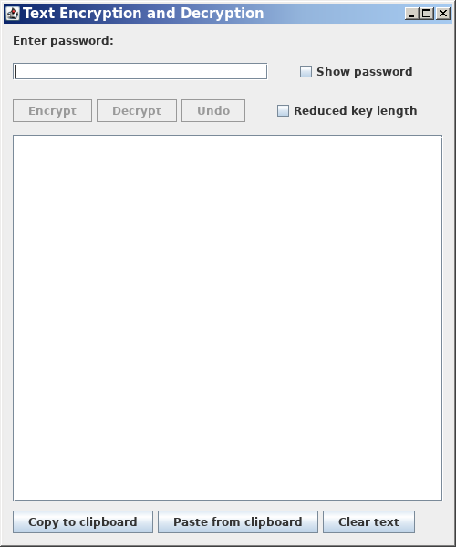

# AESTextCrypt - Version 1.1

__Note__

This repository is a fork of the original __TextCrypt__ project by Chris Wood.  
The current `1.1` branch is an exact copy of the original source code, preserved as a starting point. No functional changes have been made yet.  
Future development, maintenance, and enhancements will be carried out in this repository.

Please __Read__ the [doc.txt](./doc.txt) for more information about this software (author: __Chris Wood__).




__Author__: Chris Wood  
__Date__: 2014-04-28  
__Original sources code__: [https://sourceforge.net/p/textcrypt/code/ci/master/tree/TextCrypt/](https://sourceforge.net/p/textcrypt/code/ci/master/tree/TextCrypt/)

## Original source tree

```
TextCrypt/
|-- META-INF/
|   |-- MANIFEST.MF
|   \-- MANIFEST_old.MF
|-- resources/
|   \-- file_locked.png
|-- bin/
|-- src/
|   |-- com/
|   |   \-- ceperman/
|   |       \-- textcrypt/
|   |           |-- Base64.java
|   |           |-- CryptUtils.java
|   |           |-- ExpandableByteBuffer.java
|   |           |-- Messages.java
|   |           |-- Strings.java
|   |           |-- TextCrypt.java
|   |           |-- messages.properties
|   |           \-- version.properties
|   \-- org/
|       \-- mindrot/
|           \-- jbcrypt/
|               \-- BCrypt.java
|-- bcprov-jdk15on-149.jar
|-- doc.txt
|-- history.txt
\-- legal.txt

```

## Compiling the source code

```bash
javac -cp "bcprov-jdk15on-149.jar" -d bin src/com/ceperman/textcrypt/*.java src/org/mindrot/jbcrypt/*.java
```

## How to execute the "TextCrypt.class"

```bash
java -cp "bin:bcprov-jdk15on-149.jar" com.ceperman.textcrypt.TextCrypt
```
\|
\| __Note__: On Windows, replace `:` with `;` in the classpath.
\|

## Creating the `TextCrypt.jar` file

```bash
jar cvfm TextCrypt.jar META-INF/MANIFEST_old.MF -C bin/ . -C resources/ .
```

Contents of `MANIFEST_old.MF`:
```text
Manifest-Version: 1.0
Created-By: 1.8.0_171 (Oracle Corporation)
Main-Class: com.ceperman.textcrypt.TextCrypt
Class-Path: bcprov-jdk15on-149.jar
```

You should now have the following JAR files in the project's root directory:  
* __bcprov-jdk15on-149.jar__
* __TextCrypt.jar__

You can then start the application with: `java -jar TextCrypt.jar`.

## Creating a "fat" JAR

First, extract the contents of `bcprov-jdk15on-149.jar` (into the temporary directory `./libs/`)

```bash
mkdir -p ./libs
cd libs
jar xf ../bcprov-jdk15on-149.jar
cd ..

cp -r ./libs/org/bouncycastle/ ./bin/org/
rm -rf ./libs
```

You can now create a standalone JAR containing the BouncyCastle classes:

```bash
jar cvfm TextCrypt.jar META-INF/MANIFEST.MF -C bin/ . -C resources/ .
```
The new `MANIFEST.MF` has been updated accordingly: the `Class-Path` entry has been removed because the Bouncy Castle `classes` are now bundled directly into the JAR.

